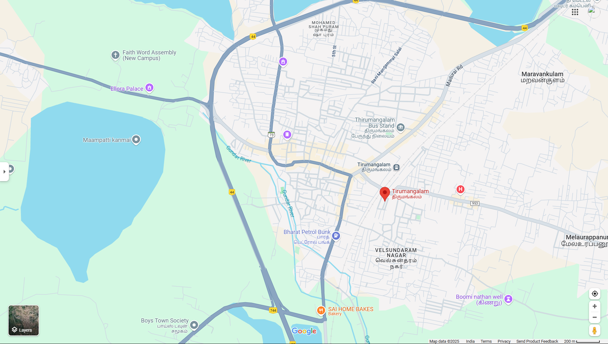
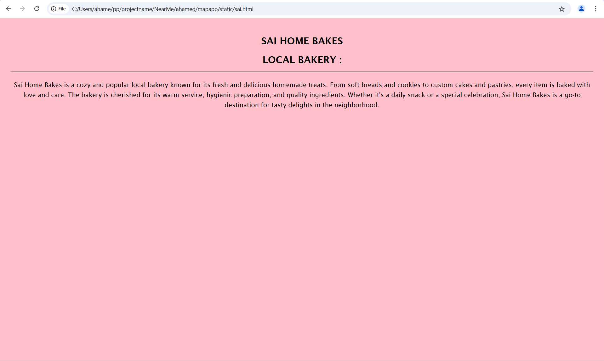
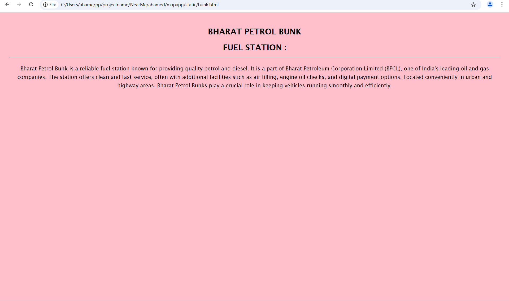
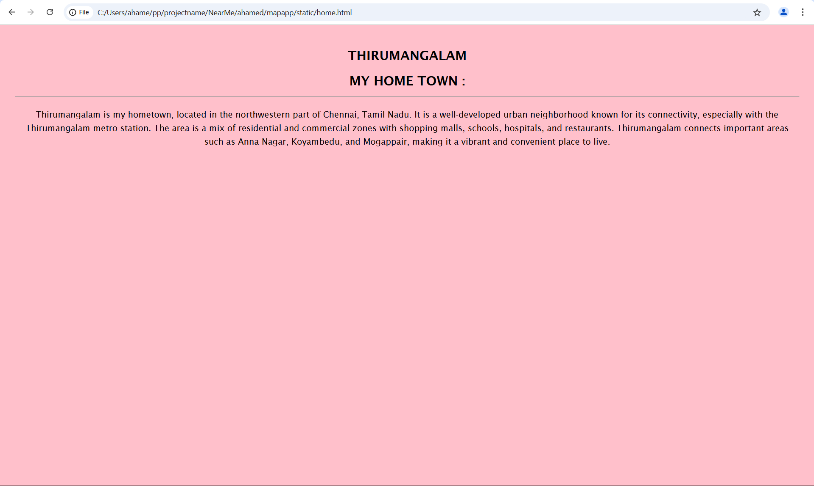
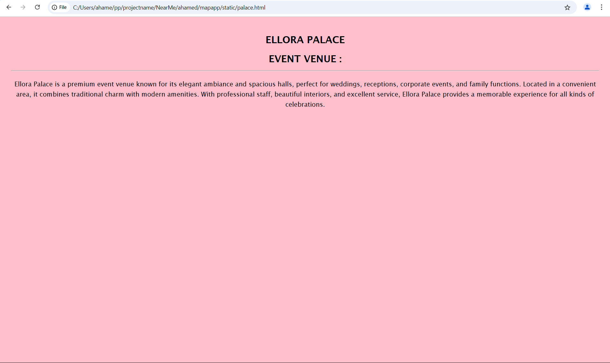
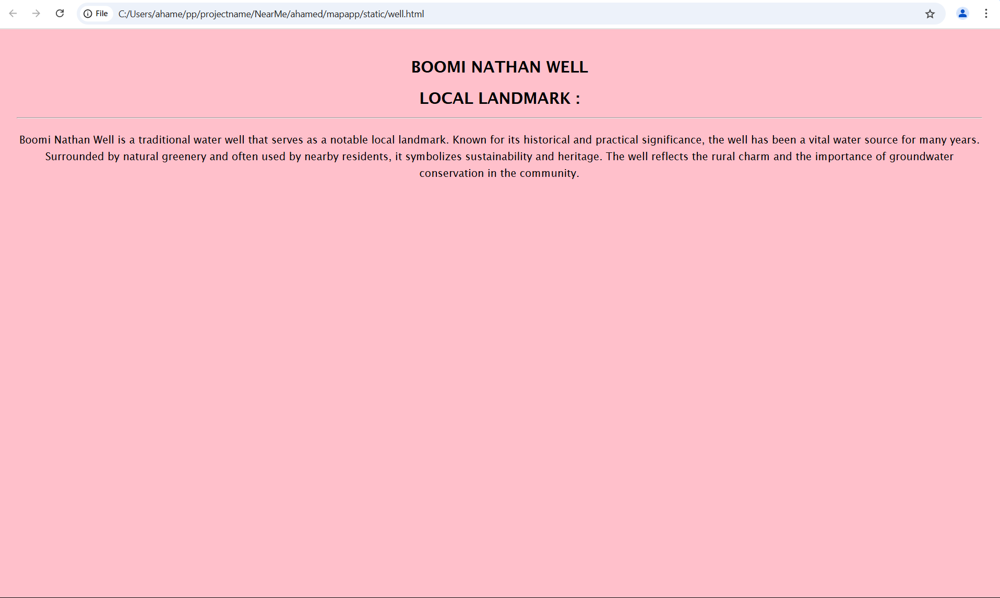

# Ex04 Places Around Me
## Date: 

## AIM
To develop a website to display details about the places around my house.

## DESIGN STEPS

### STEP 1
Create a Django admin interface.

### STEP 2
Download your city map from Google.

### STEP 3
Using ```<map>``` tag name the map.

### STEP 4
Create clickable regions in the image using ```<area>``` tag.

### STEP 5
Write HTML programs for all the regions identified.

### STEP 6
Execute the programs and publish them.

## CODE
```python
map.html
<html>
    <head>
        <title>My City</title>
    </head>
    <body>
        <center>
        <h1 >
        <font color="black" >THIRUMANGALAM                  
  
        </font>
        </h1>
        <h3 > <font color ="black" > AHAMED SHINE      REG NO: 212224040017 </font></h3>
        
            
            <map name="MyCity">
                <area shape="rect" coords="758,222,1040,320" href="home.html" title="MY HOME">
                <area shape="rect" coords="679,260,947,394" href="bunk.html" title="BP BUNK">
                <area shape="rect" coords="746,115,1028,213" href="sai.html" title="SAI BAKES">
                <area shape="rect" coords="701,562,969,696" href="well.html" title="NATHAN WELL">
                <area shape="rect" coords="820,464,1017,520" href="palace.html" title="ELLORA PALACE">       
            </map>
        </center>
    </body>
</html>

home.html

<!DOCTYPE html>
<html lang="en">
<head>
    <meta charset="UTF-8">
    <meta name="viewport" content="width=device-width, initial-scale=1.0">
    <title>My Hometown - Thirumangalam</title>
    <style>
        body {
            background-color: pink;
            font-family: 'Lucida Sans', 'Lucida Sans Regular', 'Lucida Grande', 
                         'Lucida Sans Unicode', Geneva, Verdana, sans-serif;
            text-align: center;
            padding: 20px;
            line-height: 1.6;
        }

        h2 {
            margin: 10px 0;
        }

        p {
            font-size: 16px;
            margin-top: 20px;
        }

        hr {
            color: white;
        }
    </style>
</head>
<body>
    <h2>THIRUMANGALAM</h2>
    <h2>MY HOME TOWN :</h2>
    <hr>
    <p>
        Thirumangalam is my hometown, located in the northwestern part of Chennai, Tamil Nadu. 
        It is a well-developed urban neighborhood known for its connectivity, especially with the Thirumangalam metro station. 
        The area is a mix of residential and commercial zones with shopping malls, schools, hospitals, and restaurants. 
        Thirumangalam connects important areas such as Anna Nagar, Koyambedu, and Mogappair, making it a vibrant and convenient place to live.
    </p>
</body>
</html>

bunk.html

<!DOCTYPE html>
<html lang="en">
<head>
    <meta charset="UTF-8">
    <meta name="viewport" content="width=device-width, initial-scale=1.0">
    <title>Bharat Petrol Bunk</title>
    <style>
        body {
            background-color: pink;
            font-family: 'Lucida Sans', 'Lucida Sans Regular', 'Lucida Grande', 
                         'Lucida Sans Unicode', Geneva, Verdana, sans-serif;
            text-align: center;
            padding: 20px;
            line-height: 1.6;
        }

        h2 {
            margin: 10px 0;
        }

        p {
            font-size: 16px;
            margin-top: 20px;
        }

        hr {
            color: white;
        }
    </style>
</head>
<body>
    <h2>BHARAT PETROL BUNK</h2>
    <h2>FUEL STATION :</h2>
    <hr>
    <p>
        Bharat Petrol Bunk is a reliable fuel station known for providing quality petrol and diesel. 
        It is a part of Bharat Petroleum Corporation Limited (BPCL), one of India's leading oil and gas companies. 
        The station offers clean and fast service, often with additional facilities such as air filling, 
        engine oil checks, and digital payment options. Located conveniently in urban and highway areas, 
        Bharat Petrol Bunks play a crucial role in keeping vehicles running smoothly and efficiently.
    </p>
</body>
</html>

well.html

<!DOCTYPE html>
<html lang="en">
<head>
    <meta charset="UTF-8">
    <meta name="viewport" content="width=device-width, initial-scale=1.0">
    <title>Boomi Nathan Well</title>
    <style>
        body {
            background-color: pink;
            font-family: 'Lucida Sans', 'Lucida Sans Regular', 'Lucida Grande', 
                         'Lucida Sans Unicode', Geneva, Verdana, sans-serif;
            text-align: center;
            padding: 20px;
            line-height: 1.6;
        }

        h2 {
            margin: 10px 0;
        }

        p {
            font-size: 16px;
            margin-top: 20px;
        }

        hr {
            color: white;
        }
    </style>
</head>
<body>
    <h2>BOOMI NATHAN WELL</h2>
    <h2>LOCAL LANDMARK :</h2>
    <hr>
    <p>
        Boomi Nathan Well is a traditional water well that serves as a notable local landmark. 
        Known for its historical and practical significance, the well has been a vital water source for many years. 
        Surrounded by natural greenery and often used by nearby residents, it symbolizes sustainability and heritage. 
        The well reflects the rural charm and the importance of groundwater conservation in the community.
    </p>
</body>
</html>

bakes.html

<!DOCTYPE html>
<html lang="en">
<head>
    <meta charset="UTF-8">
    <meta name="viewport" content="width=device-width, initial-scale=1.0">
    <title>Sai Home Bakes</title>
    <style>
        body {
            background-color: pink;
            font-family: 'Lucida Sans', 'Lucida Sans Regular', 'Lucida Grande', 
                         'Lucida Sans Unicode', Geneva, Verdana, sans-serif;
            text-align: center;
            padding: 20px;
            line-height: 1.6;
        }

        h2 {
            margin: 10px 0;
        }

        p {
            font-size: 16px;
            margin-top: 20px;
        }

        hr {
            color: white;
        }
    </style>
</head>
<body>
    <h2>SAI HOME BAKES</h2>
    <h2>LOCAL BAKERY :</h2>
    <hr>
    <p>
        Sai Home Bakes is a cozy and popular local bakery known for its fresh and delicious homemade treats. 
        From soft breads and cookies to custom cakes and pastries, every item is baked with love and care. 
        The bakery is cherished for its warm service, hygienic preparation, and quality ingredients. 
        Whether it's a daily snack or a special celebration, Sai Home Bakes is a go-to destination for tasty delights in the neighborhood.
    </p>
</body>
</html>


palace.html

<!DOCTYPE html>
<html lang="en">
<head>
    <meta charset="UTF-8">
    <meta name="viewport" content="width=device-width, initial-scale=1.0">
    <title>Ellora Palace</title>
    <style>
        body {
            background-color: pink;
            font-family: 'Lucida Sans', 'Lucida Sans Regular', 'Lucida Grande', 
                         'Lucida Sans Unicode', Geneva, Verdana, sans-serif;
            text-align: center;
            padding: 20px;
            line-height: 1.6;
        }

        h2 {
            margin: 10px 0;
        }

        p {
            font-size: 16px;
            margin-top: 20px;
        }

        hr {
            color: white;
        }
    </style>
</head>
<body>
    <h2>ELLORA PALACE</h2>
    <h2>EVENT VENUE :</h2>
    <hr>
    <p>
        Ellora Palace is a premium event venue known for its elegant ambiance and spacious halls, 
        perfect for weddings, receptions, corporate events, and family functions. 
        Located in a convenient area, it combines traditional charm with modern amenities. 
        With professional staff, beautiful interiors, and excellent service, 
        Ellora Palace provides a memorable experience for all kinds of celebrations.
    </p>
</body>
</html>

```


## OUTPUT








## RESULT
The program for implementing image maps using HTML is executed successfully.
